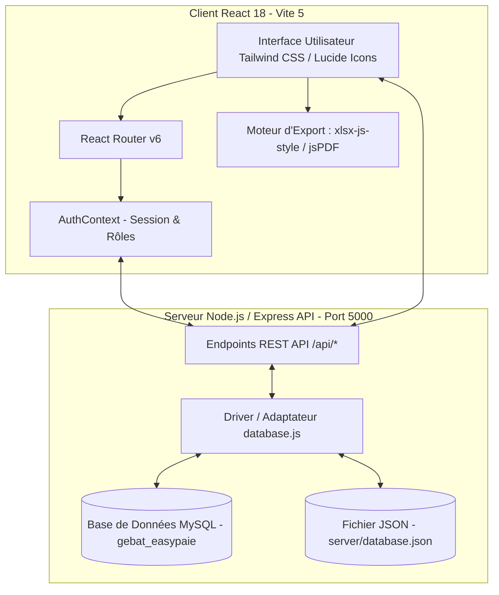

# 🏗️ GEBAT EasyPaie — Système Intégré de Digitalisation & de Gestion de la Paie Ouvrière


**GEBAT EasyPaie** est la plateforme digitale de référence conçue sur-mesure pour **GEBAT (Générale de Bâtiment)** et ses partenaires (**NOURIVOIRE**, etc.). Elle automatise l'intégralité de la chaîne de traitement de la paie hebdomadaire des ouvriers sur chantiers : import intelligent des pointages, calcul automatisé des retenues d'équipements de protection individuelle (**EPI**), gestion des loyers de base-vie, calcul du net à payer au centime près et génération d'états d'édition certifiés (Excel hautement stylisés et PDF officiels avec logo GEBAT).

---

## 🌟 Sommaire & Navigation

1. [✨ Caractéristiques & Fonctionnalités Clés](#-caractéristiques--fonctionnalités-clés)
2. [🖥️ Architecture du Système](#-architecture-du-système)
3. [🚀 Guide d'Installation & Démarrage Rapide](#-guide-dinstallation--démarrage-rapide)
4. [🛢️ Configuration de la Base de Données (MySQL & JSON)](#️-configuration-de-la-base-de-données-mysql--json)
5. [🔐 Authentification & Rôles Utilisateurs](#-authentification--rôles-utilisateurs)
6. [📖 Guide Détaillé des Modules & Pages](#-guide-détaillé-des-modules--pages)
   - [Tableau de Bord Exécutif](#1-tableau-de-bord-exécutif-dashboard)
   - [Annuaire & Fiches Ouvriers à 360°](#2-annuaire--fiches-ouvriers-à-360-ouvriers--workerdetails)
   - [Import Pointages & Traitement des Salaires Bruts](#3-import-pointages--traitement-des-salaires-bruts-importpointage--conversion)
   - [Gestion des Ponctions & Cautions EPI](#4-gestion-des-ponctions--cautions-epi-ponctions)
   - [Gestion & Suivi des Loyers de Base-Vie](#5-gestion--suivi-des-loyers-de-base-vie-loyers)
   - [Moteur de Calcul de Paie](#6-moteur-de-calcul-de-paie-calculpaie)
   - [Historique des Règlements & Filtres Multi-Critères](#7-historique-des-règlements--filtres-multi-critères-historique)
   - [Centre de Rapports Financiers](#8-centre-de-rapports-financiers-rapports)
7. [📊 Spécifications des Exports Excel (.xlsx) & PDF (.pdf)](#-spécifications-des-exports-excel-xlsx--pdf-pdf)
8. [📁 Structure du Répertoire & Codebase](#-structure-du-répertoire--codebase)
9. [🛠️ Dépannage & Maintenance Technique](#-dépannage--maintenance-technique)

---

## ✨ Caractéristiques & Fonctionnalités Clés

- **Règle Stricte de Calcul Net :**
  $$\text{Net à Payer} = \text{Salaire Brut} - \text{Ponction EPI} - \text{Loyer non réglé} + \text{Remboursement EPI} - \text{Déduction EPI}$$
- **Ponctions EPI Facturées depuis la Page Dédiée :**
  - Sur la page **Calcul Paie**, les ponctions EPI ne sont plus déduites automatiquement par défaut à 3 000 FCFA. Elles s'appliquent lorsqu'elles sont enregistrées depuis la page **Ponctions EPI** ou ajustées manuellement.
- **Préservation Intégrale des Salaires Bruts :**
  - Le salaire brut importé depuis les pointages Excel est pris en compte à 100% sans altération ni conversion forcée de taux journalier.
- **Support Base de Données Hybride (MySQL / LowDB) & Export SQL :**
  - Connexion native à un serveur **MySQL** (`gebat_easypaie`) avec scripts d'initialisation (`setup_mysql.js`) et script de dump SQL automatisé (`export_sql.js`).
- **Filtres Intelligents et par Défaut :**
  - **Ponctions EPI :** Filtrage par défaut sur les ouvriers ayant des **cautions non soldées** (`Reste à cotiser > 0`), simplifiant la saisie hebdomadaire sur le terrain.
  - **Calcul Paie & KPI :** Les totaux des cartes KPI (Salaire Brut, Net à Payer, Loyers, EPI) recalculent dynamiquement leurs sommes sur la liste exacte des ouvriers affichés/filtrés (`displayedPaie`).
- **Verrouillage de Sécurité d'Intégrité (Verrou Départ) :**
  - Un ouvrier passé en statut **Parti** avec décompte validé est **verrouillé de manière stricte** (`isDepartedLocked`). Toute modification ultérieure est bloquée avec indicateur visuel de cadenas.
- **Exports Certifiés Exécutifs GEBAT :**
  - **Excel (`xlsx-js-style`) :** En-tête bi-colore **Bleu Marine GEBAT (#1565C0)** et **Or GEBAT (#F4BD0B)**, formatage monétaire (`FCFA`), alignements rigoureux et ligne de totalisation basse.
  - **PDF (`jsPDF` + `autotable`) :** Mode paysage (*Landscape*) intégrant le **logo officiel de GEBAT** (`gebat_logo.jpg`), sous-titre dynamique des filtres appliqués et numérotation automatique.
- **Application Installable (PWA) 📱 :** Configurée en Progressive Web App installable sur ordinateur, tablette et smartphone pour une utilisation fluide en mode natif.

---

## 🖥️ Architecture du Système

Le système EasyPaie repose sur un découpage modulable **Single Page Application (SPA)** couplé à une API REST Express compatible **MySQL** (via `mysql2`) et **LowDB**.



---

## 🚀 Guide d'Installation & Démarrage Rapide

### Prérequis Systèmes
- **Système d'exploitation :** Windows 10/11, macOS, ou Linux.
- **Node.js :** Version **18.x** ou supérieure (développé et validé sous Node v24 LTS).
- **Gestionnaire de paquets :** `npm`.
- **MySQL Server** *(Optionnel si utilisation de MySQL)* : Port `3306`.

### Installation en 3 Étapes

#### 1. Installation automatique sous Windows (Script Batch)
Un script batch à la racine du projet (`install.bat`) installe les dépendances et prépare l'environnement :
```cmd
install.bat
```

#### 2. Installation manuelle via Terminal
```bash
# 1. Se positionner dans le dossier du projet
cd gebat-easypaie

# 2. Installer les dépendances NPM
npm install
```

### Lancement de l'Application

**Terminal 1 — Serveur Backend API (Node.js / Express) :**
```bash
npm run server
```
> ℹ️ *Le serveur API démarre sur : `http://localhost:5000`*

**Terminal 2 — Interface Frontend Web (React / Vite) :**
```bash
npm run dev
```
> ℹ️ *L'application web s'ouvre sur : `http://localhost:3000` (ou port alternatif si occupé).*

---

## 🛢️ Configuration de la Base de Données (MySQL & JSON)

GEBAT EasyPaie prend en charge nativement les bases de données **MySQL** et **LowDB (JSON)**.

### Paramètres de Connexion MySQL par Défaut
L'application se connecte au serveur MySQL local avec les identifiants standards de développement :

| Paramètre | Valeur par défaut | Variable d'environnement |
| :--- | :--- | :--- |
| **Hôte (Host)** | `localhost` | `DB_HOST` |
| **Port** | `3306` | `DB_PORT` |
| **Utilisateur** | `root` | `DB_USER` |
| **Mot de passe** | `""` *(vide)* | `DB_PASSWORD` |
| **Nom de la base** | `gebat_easypaie` | `DB_NAME` |

### Scripts Utilitaires de Base de Données

1. **Initialiser / Créer la base de données MySQL :**
   ```bash
   node scratch/setup_mysql.js
   ```
   *Ce script crée la base `gebat_easypaie`, construit l'ensemble des tables et importe les données initiales.*

2. **Générer un fichier d'export Dump SQL (.sql) :**
   ```bash
   node scratch/export_sql.js
   ```
   *Ce script extrait toutes les données de la base et génère le fichier `gebat_easypaie_database.sql` compatible MySQL, MariaDB, PostgreSQL et SQLite.*

---

## 🔐 Authentification & Rôles Utilisateurs

GEBAT EasyPaie intègre une gestion des autorisations basée sur les rôles (**RBAC**). Les sessions sont maintenues de façon sécurisée et les comptes s'administrent depuis la page **Paramètres**.

### Identifiants par Défaut (Administrateur Principal)
- **Identifiant :** `admin`
- **Mot de passe :** `admin123`

### Hiérarchie des Rôles
| Rôle | Privilèges |
| :--- | :--- |
| **Administrateur** (`Administrateur Général GEBAT`) | **Accès total à 100%** : Gestion des ouvriers, calcul de paie, loyers, ponctions, exports, création d'utilisateurs et réinitialisation de base. |
| **Trésorerie / Finance** (`Responsable Trésorerie`) | Accès aux calculs de paie, validation financière, virements Mobile Money, exports Excel/PDF et états financiers. |
| **Ressources Humaines (RH)** (`Gestionnaire RH`) | Accès à l'annuaire des ouvriers, suivi des départs, pointages et suivi disciplinaire/EPI. |
| **Pointeur Chantier** (`Pointeur Chantier`) | Accès restreint à la consultation et à la saisie des pointages de chantier. |

---

## 📖 Guide Détaillé des Modules & Pages

### 1. Tableau de Bord Exécutif (`Dashboard`)
- **Indicateurs KPI temps réel :** Nombre d'ouvriers actifs, masse salariale brute, ponctions EPI collectées, déductions de loyers et total net à payer.
- **Ajustement Dynamique :** Les indicateurs s'adaptent dynamiquement aux filtres appliqués (Site, Qualification, Période).

### 2. Annuaire & Fiches Ouvriers à 360° (`Ouvriers` & `WorkerDetails`)
- **Fiche Ouvrier Individuelle :** Jauge de progression de la caution EPI (Plafond par site : ex. Bingerville 12 000 FCFA, Songon 9 000 FCFA), historique des prélèvements, mensualités de loyer et règlements perçus avec coordonnées Mobile Money (`Wave`, `Orange`, `MTN`).
- **Décompte de Clôture Départ Ouvrier :**
  - *EPI complet & restitué* → Remboursement intégral de la caution cotisée (`epi_remboursement`).
  - *EPI non retourné / perdu* → Déduction complémentaire sur la paie (`epi_deduction`).
  - **🔒 Verrou Départ :** Verrouillage automatique de la fiche dès validation du départ.

### 3. Import Pointages & Traitement des Salaires Bruts (`ImportPointage` & `Conversion`)
- **Importateur Excel Intelligent :** Glissez-déposez une fiche de pointage de chantier (`.xlsx` ou `.xls`).
- **Mapping & Réconciliation :** Détection automatique du chantier, extraction des périodes/semaines et association avec le montant **TOTAL brut** de chaque ouvrier.

### 4. Gestion des Ponctions & Cautions EPI (`Ponctions`)
- **Prélèvements Hebdomadaires :** Saisie et suivi des retenues sur caution EPI (3 000 FCFA/semaine ou sur mesure).
- **Filtre Cautions Non Soldées :** Affichage prioritaire des ouvriers n'ayant pas atteint leur plafond d'EPI.

### 5. Gestion & Suivi des Loyers de Base-Vie (`Loyers`)
- **Imputation des Loyers :** Suivi mensuel des loyers d'hébergement base-vie attribués aux ouvriers.
- **Imputation Automatique :** Tout loyer échu non réglé est automatiquement déduit lors du calcul de la paie.

### 6. Moteur de Calcul de Paie (`CalculPaie`)
- **Calcul du Net à Payer :** Prise en compte du Salaire Brut, de la ponction EPI (si saisie/existante), du loyer et des remboursements/déductions de départ.
- **Exportation et Validation :** Validation des paies de la semaine et génération d'ordres de virement Mobile Money (`Wave`, `Orange`, `MTN`).

### 7. Historique des Règlements & Filtres Multi-Critères (`Historique`)
- **Filtres Croisés :** Filtrage instantané par Chantier/Site, Qualification/Département, Semaine et recherche textuelle.
- **Registre Complet :** Tableau détaillé avec colonnes financières, statuts de paiement et informations de contact.

### 8. Centre de Rapports Financiers (`Rapports`)
- **Bilans Analytiques :** Rapports consolidés sur les ponctions EPI, les loyers et la masse salariale globale exportables en Excel et PDF.

---

## 📊 Spécifications des Exports Excel (.xlsx) & PDF (.pdf)

| Élément | Spécification Excel (`xlsx-js-style`) | Spécification PDF (`jsPDF` + `autotable`) |
| :--- | :--- | :--- |
| **En-tête de Titre** | Fond **Bleu Marine (#1565C0)**, Texte Blanc 16pt Gras, fusionné sur toute la largeur. | Bandeau Bleu Marine GEBAT avec **Logo officiel encadré** et titre 17pt Blanc. |
| **Sous-titre / Filtres** | Fond **Or GEBAT (#F4BD0B)**, Texte Bleu Nuit 11pt, mentionnant les filtres actifs. | Ruban Or (#F4BD0B), détails des filtres appliqués et date d'édition. |
| **En-tête des Colonnes** | Fond **Ardoise (#1E293B)**, Texte Blanc 10pt Gras avec hauteurs et largeurs adaptées. | En-tête de tableau AutoTable Bleu Marine (`#1565C0`), texte blanc 9pt. |
| **Format des Données** | Montants financiers **alignés à droite** avec séparateurs de milliers et suffixe `FCFA`. | Formatage monétaire `formatCurrency` avec suffixes `FCFA` et lignes alternées. |
| **Ligne de Totalisation** | Ligne **Total Général** Or / Bleu avec sommes exactes calculées sur la sélection. | Ligne de bas de page avec sommes globales calculées. |

---

## 📁 Structure du Répertoire & Codebase

```text
gebat-easypaie/
├── install.bat                      # Script d'installation rapide sous Windows
├── package.json                     # Dépendances NPM et scripts de build (React, Vite, Express, mysql2)
├── vite.config.js                   # Configuration du bundler Vite & PWA
├── tailwind.config.js               # Configuration du design system Tailwind CSS
├── gebat_logo.jpg                   # Logo officiel haute définition GEBAT
├── gebat_easypaie_database.sql      # Dump SQL complet de la base de données
│
├── server/                          # Backend Node.js / Express API
│   ├── index.js                     # Serveur REST Express (Endpoints /api/*)
│   ├── database.js                  # Adaptateur MySQL & LowDB
│   └── database.json                # Fichier JSON de persistance locale
│
├── scratch/                         # Scripts utilitaires de maintenance
│   ├── setup_mysql.js               # Script de création et d'initialisation de la base MySQL
│   └── export_sql.js                # Script de génération du dump SQL
│
└── src/                             # Source Frontend React 18
    ├── main.jsx                     # Point d'entrée principal & React Router
    ├── App.jsx                      # Routes et garde d'authentification
    ├── index.css                    # Design system et styles globaux
    ├── assets/                      # Ressources statiques (logo GEBAT)
    ├── contexts/                    # Contexte d'authentification (AuthContext)
    ├── lib/                         # Utilitaires & formatage (utils.js)
    ├── components/                  # Layout, Sidebar et Header exécutive
    └── pages/                       # Vues applicatives (Dashboard, CalculPaie, Ouvriers, etc.)
```

---

## 🛠️ Dépannage & Maintenance Technique

### 1. Conflit de Port (Erreur `EADDRINUSE: port 5000`)
Si le port `5000` ou `3000` est déjà utilisé par un ancien processus Node :
```cmd
cmd /c taskkill /F /IM node.exe
```

### 2. Réinitialisation ou Réimportation de la Base MySQL
Pour réinitialiser proprement la base de données MySQL et charger le dernier dump :
```bash
node scratch/setup_mysql.js
```

### 3. Exporter une Sauvegarde SQL Récente
Pour exporter l'ensemble des données actuelles dans le fichier `gebat_easypaie_database.sql` :
```bash
node scratch/export_sql.js
```

---

<div align="center">
  <p><strong>GEBAT EasyPaie v2.1.0 — Conçu avec excellence pour la performance et la rigueur sur chantier.</strong></p>
  <p><em>© 2026 GEBAT — Tous droits réservés.</em></p>
</div>"# Gebat_EasyPaie" 
"# Gebat_EasyPaie" 
